# 项目介绍

**功能：**

1. CodeQL 扫描结果可视化
2. AI 审计输出漏洞结果

**环境配置如下：**

1. Ubuntu 24.04.1
2. PHP 8.3.6 
3. ThinkPHP 8.1.3
4. mysql  Ver 8.0.43-0ubuntu0.24.04.2 for Linux on x86_64 ((Ubuntu))
5. CodeQL 2.23.3

**项目主要分为四个模块：**

1. **项目概要：** 展示项目与仓库之间的简介信息。
2. **项目列表：** 项目列表的展示页面，可进行项目添加、删除操作。
3. **仓库列表：** 仓库列表的展示页面，添加项目后，对应的仓库会添加于该页面。
4. **CodeQL：** 漏洞列表的展示页面，由仓库进行 Scan 后增加，详情页面可查看具体代码和 AI 结果。

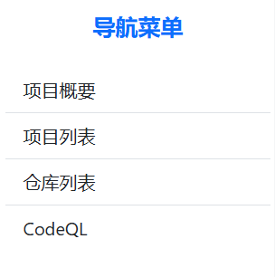

项目概要 - 界面

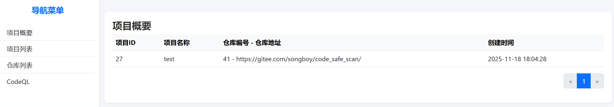

项目列表 - 界面

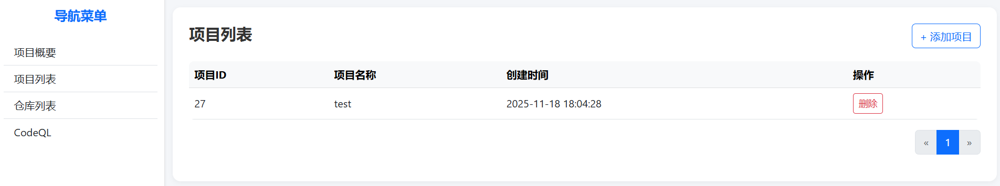

仓库 - 界面

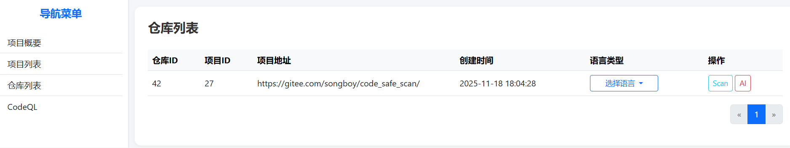

CodeQL - 界面

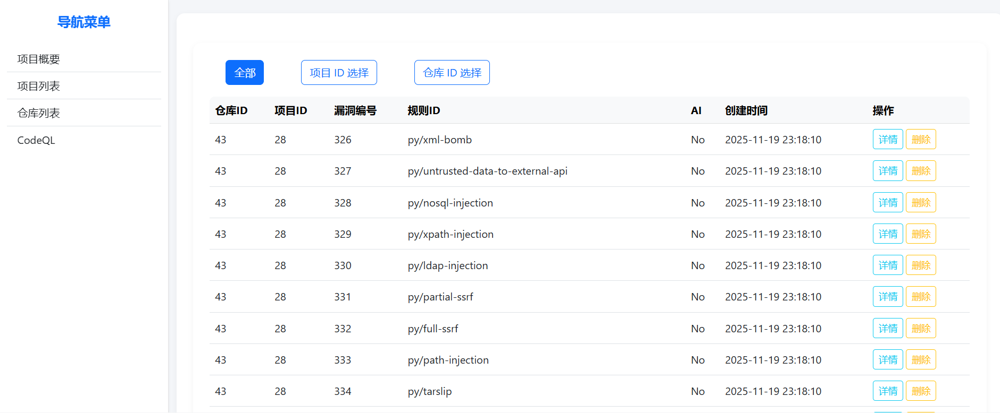

# 安装使用

下载项目：

```bash
git clone https://github.com/wdc15664/CodeQL_AI_Web.git
cd CodeQL_AI_Web/
```

安装 MySQL，创建数据库：

```bash
# 安装MySQL
sudo apt install mysql-client mysql-server -y

# 创建数据库
mysql -u root -p < ./mysql/codeqlGPT.sql
```

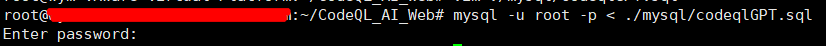

进入数据库，开启密码登录：

```mysql
sudo mysql

ALTER USER 'root'@'localhost' IDENTIFIED WITH mysql_native_password BY '123456';
FLUSH PRIVILEGES;

exit;
```

安装相关依赖：

```bash
# 安装依赖php-cli，来使用ThinkPHP的命令行、内置服务器
sudo apt install php8.3-cli -y

# PHP对应的数据库驱动扩展，用来ThinkPHP连接MySQL。
sudo apt install php8.3-mysql -y

# 使用Composer安装依赖
cd codeql_GPT/
apt install composer -y
composer install

# 创建CodeQL软连接方便调用
sudo ln -s /root/CodeQL_AI_Web/codeql_GPT/extend/codeql/codeql /usr/local/bin/codeql
```

启动内置服务器：

```bash
php think run -H 0.0.0.0 -p 8000
```

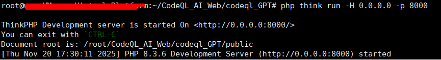

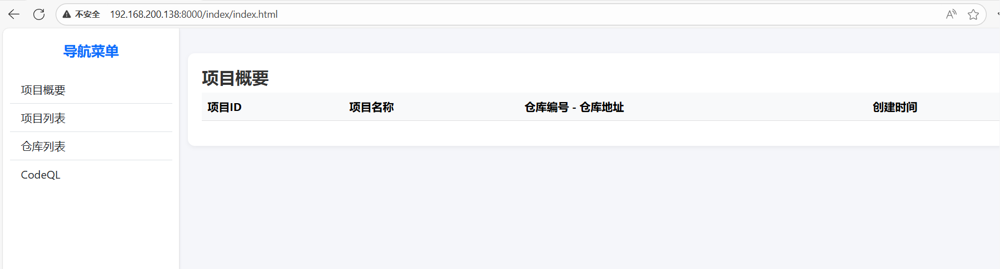

如果数据库账户/密码有改动，使用 AI 分析功能，需要在`CodeQL_AI_Web/codeql_GPT/.env`文件中修改相关数据，填入 BAILIAN_SK 调用百炼 AI 进行分析

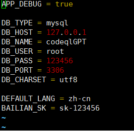

# 使用示例

项目列表界面 -> 添加项目

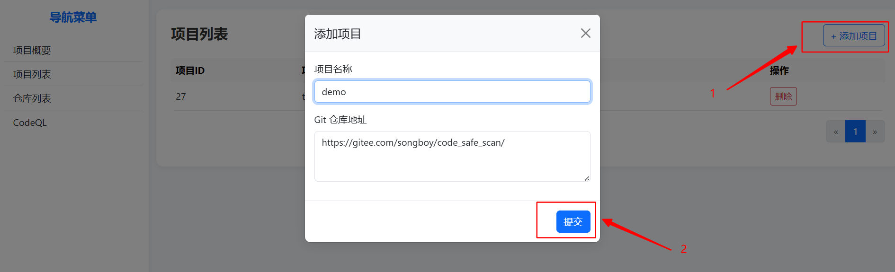

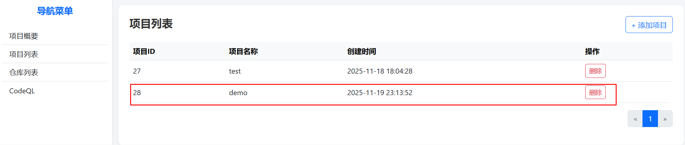

仓库列表界面 -> 选择项目语言

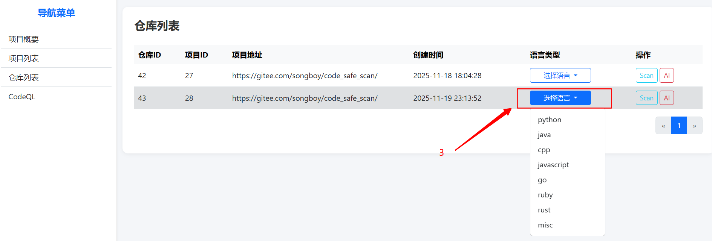

选择项目语言后，可对仓库进行相应操作：

1. Scan 按钮进行 CodeQL 规则库代码扫描
2. AI 按钮进行 AI 扫描 CodeQL 结果

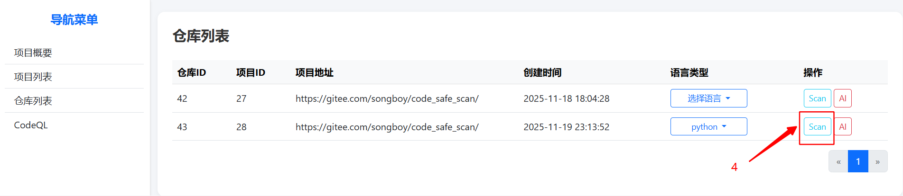

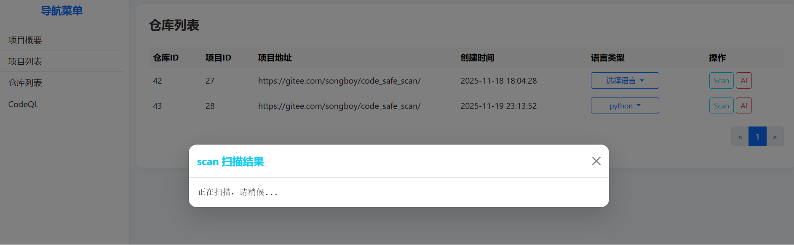

扫描完成后会输出相应信息

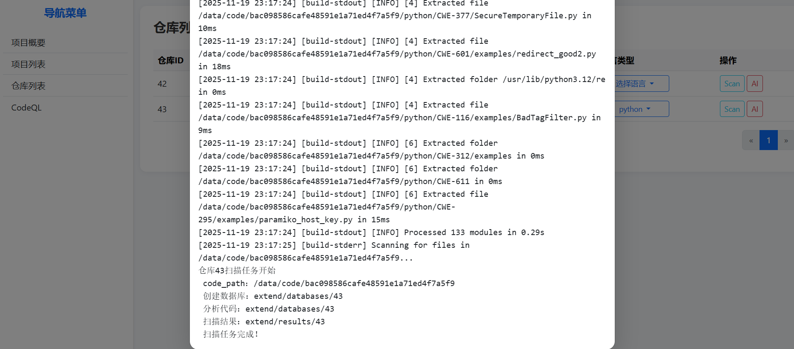

进入 CodeQL 界面


点击详情可查看对应漏洞的详细信息

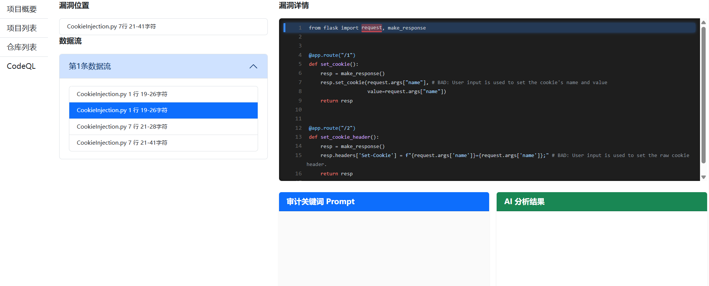

此时无 AI 信息，返回仓库列表界面 -> AI 按钮

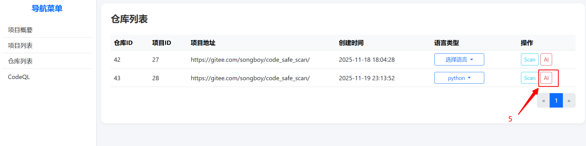

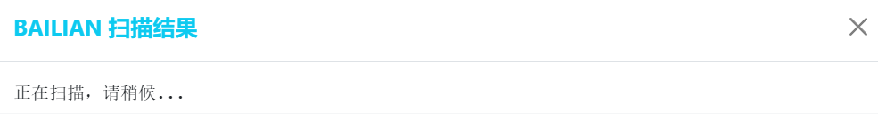

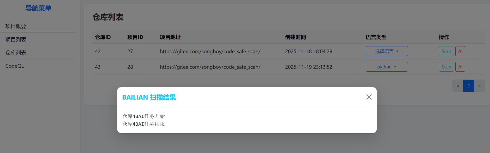

AI 审计完成后，具体漏洞信息（例）如下显示：
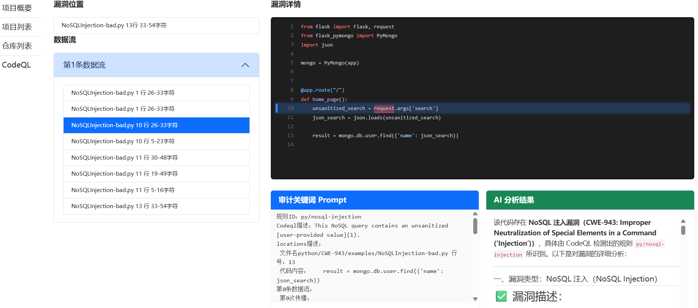